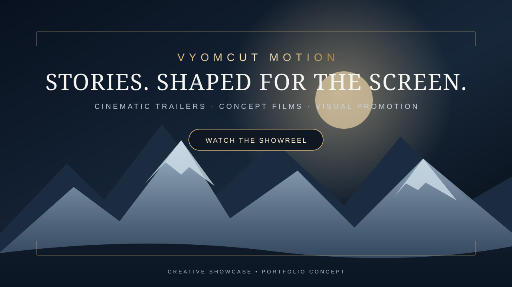
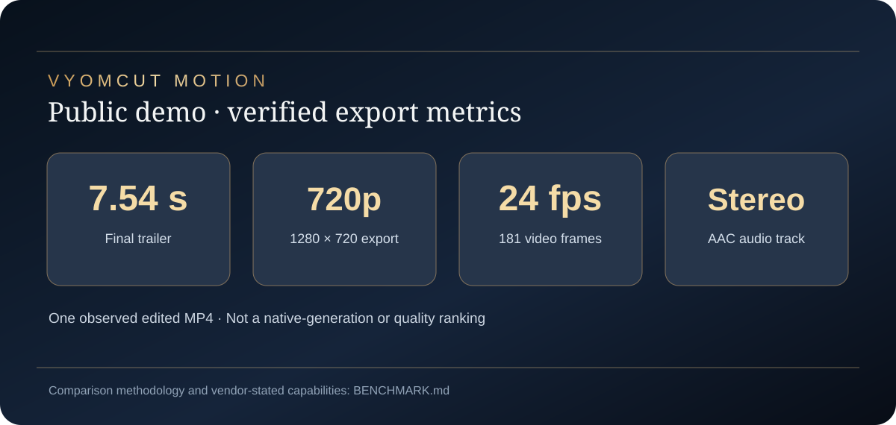
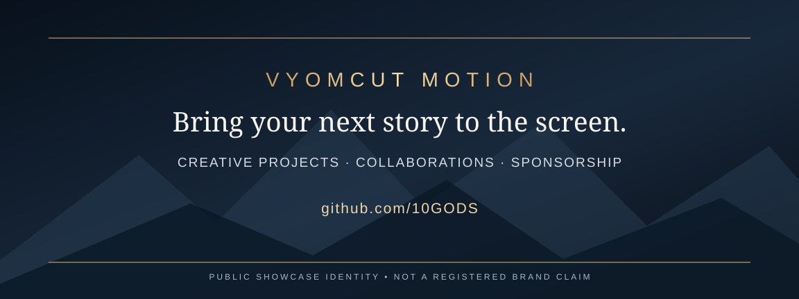

# VYOMCUT MOTION

### Stories. Shaped for the screen.

**Cinematic trailers · Concept films · Brand storytelling · Visual promotion**

[▶ Watch the Demo](media/VYOMCUT_BUSINESS_DEMO.mp4) · [📊 Demo Benchmark](BENCHMARK.md) · [♥ Sponsor the Project](https://github.com/sponsors/10GODS) · [Contact the Studio](https://github.com/10GODS)

**A creative studio showcase and portfolio identity.** VYOMCUT MOTION is not represented here as a registered brand, company, or trademark.

---

## The studio

**VYOMCUT MOTION** explores cinematic visual storytelling: turning a story idea, promotional concept, or creative brief into a trailer-style presentation with striking atmosphere, visual identity, motion, sound, and a distinctive finish.

This is our **public portfolio showcase**—a place to view creative demonstrations, connect on future projects, and support the work. It is not a source-code release or a claim that the fictional campaign shown below is a commissioned commercial advertisement.

## Featured film · Business demonstration

**[▶ Play or download the business demo](media/VYOMCUT_BUSINESS_DEMO.mp4)**

*Original creative demonstration · Fictional promotional concept · Portfolio use*

The film presents an opening title, cinematic promotional imagery, atmosphere and sound, and a closing presentation card. Its fictional campaign illustrates a possible creative direction; it does not imply that an actual business commissioned or endorsed it.

---

## Demonstration benchmark & industry context

**[📊 Read the full benchmark and published-capability comparison](BENCHMARK.md)**

The published MP4 was inspected as **one finished, edited trailer**. Its observed properties are **7.542 seconds, 1280×720 export, 24 fps, and an AAC stereo audio track**. Those are output-file measurements, **not** a native generation-resolution claim or an independent quality score.

The benchmark document also sets these observations alongside **published capabilities** of Seedance 2.0, Runway Gen-4.5, Google Veo 3.1, and Kling VIDEO 3.0. **No matched competitor test has been conducted**, so the showcase does not claim that VYOMCUT is faster, higher-quality, cheaper, or superior to those products.

---

## Showcase gallery

<table>
  <tr>
    <td align="center" width="50%">
       
      <b>Figure 1.</b> Demonstration video preview
    </td>
    <td align="center" width="50%">
       
      <b>Figure 2.</b> Creative identity and showcase poster
    </td>
  </tr>
  <tr>
    <td align="center" colspan="2">
       
      <b>Figure 3.</b> Collaboration and studio contact card
    </td>
  </tr>
</table>

## Creative directions

| Trailer and promotion | Story and presentation |
| :--- | :--- |
| Cinematic business concepts | Story-driven teasers |
| Short brand-style promo videos | Creative concept films |
| Atmospheric visual campaigns | Character and environment introductions |
| Branded title and end screens | Edited showreels and presentation videos |

## Collaborate

For commissions, showcase collaborations, or sponsorship enquiries, [contact the studio on GitHub](https://github.com/10GODS). Share your project type, intended audience, approximate duration, preferred delivery date, and any helpful visual references.

**[♥ Sponsor VYOMCUT MOTION](https://github.com/sponsors/10GODS)**

---

**Public showcase only.** The studio identity and example campaign are presented for creative portfolio purposes, not as a registered-brand claim. Private production materials and client work are not shared in this repository. See [portfolio rights and usage](RIGHTS.md).
